# 📊 Home Page Redesign - Visual Diagrams

> **ملف مخصص للرسوم التوضيحية والـ Diagrams**

---

## 🗺️ Overall Architecture

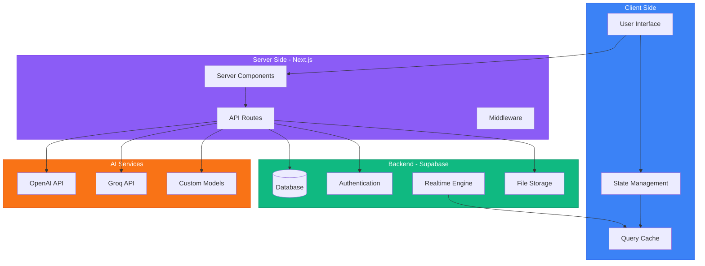

---

## 🎯 User Journey Flow

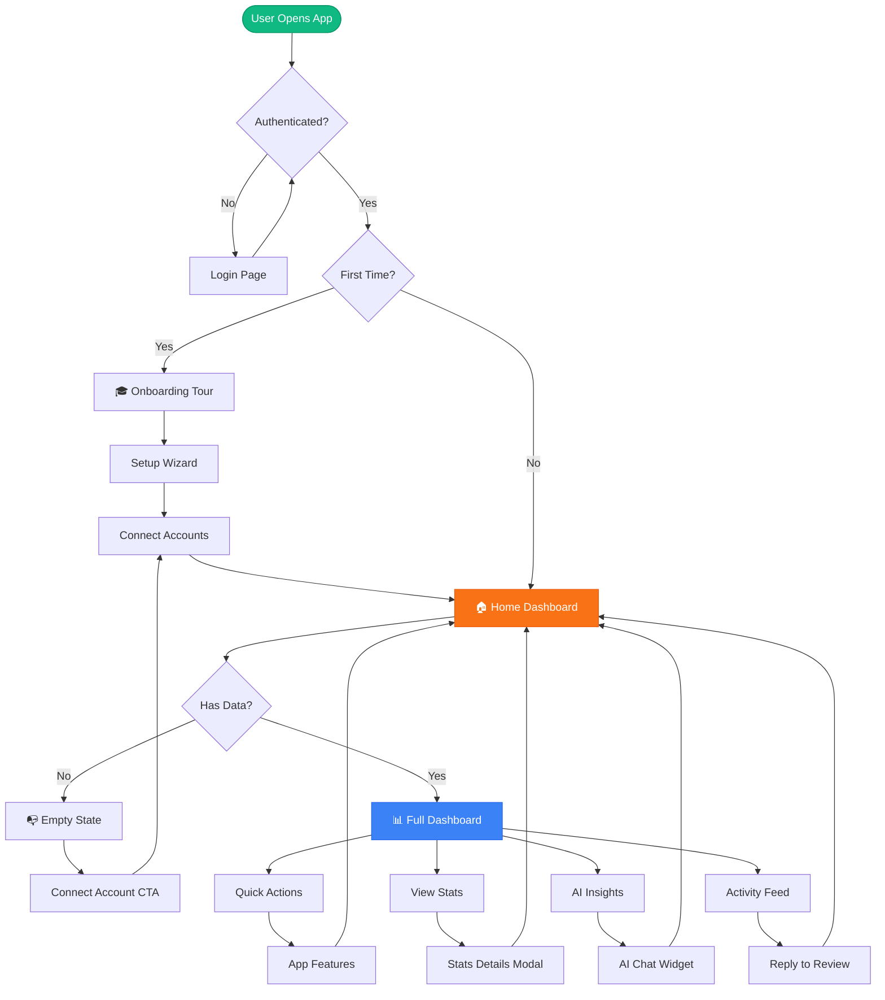

---

## 📱 Page Layout Structure

```mermaid
graph TB
    Page[Home Page Container]

    Page --> BG[Background Layer]
    Page --> Content[Content Layer]

    BG --> Gradient[Animated Gradient]
    BG --> Blobs[Floating Blobs]

    Content --> Header[Smart Header]
    Content --> Main[Main Content]

    Header --> Avatar[User Avatar]
    Header --> Welcome[Welcome Message]
    Header --> Actions[Header Actions]

    Actions --> Lang[Language Switcher]
    Actions --> Notif[Notifications]
    Actions --> Settings[Settings Button]
    Actions --> Logout[Logout Button]

    Main --> Hero[Dashboard Hero]
    Main --> Quick[Quick Actions]
    Main --> Stats[Stats Overview]
    Main --> AI[AI Insights]
    Main --> Activities[Activities Section]

    Hero --> Greeting[Personalized Greeting]
    Hero --> Progress[Profile Progress]
    Hero --> Summary[Quick Summary]

    Quick --> QA1[Upload Video]
    Quick --> QA2[View Analytics]
    Quick --> QA3[Reply Reviews]
    Quick --> QA4[Manage Locations]
    Quick --> QA5[Create Post]
    Quick --> QA6[AI Studio]

    Stats --> SC1[Locations Card]
    Stats --> SC2[Reviews Card]
    Stats --> SC3[Rating Card]
    Stats --> SC4[Accounts Card]
    Stats --> SC5[YouTube Card]

    AI --> InsightsList[Insights List]
    AI --> ChatWidget[AI Chat Widget]
    AI --> NotifCenter[Notification Center]

    Activities --> Feed[Activity Feed]
    Activities --> Recent[Recent Timeline]

    style Page fill:#000,stroke:#f97316,color:#fff
    style Content fill:#111827,stroke:#f97316,color:#fff
    style Hero fill:#f97316,stroke:#ea580c,color:#fff
```

---

## 🎨 Component Hierarchy

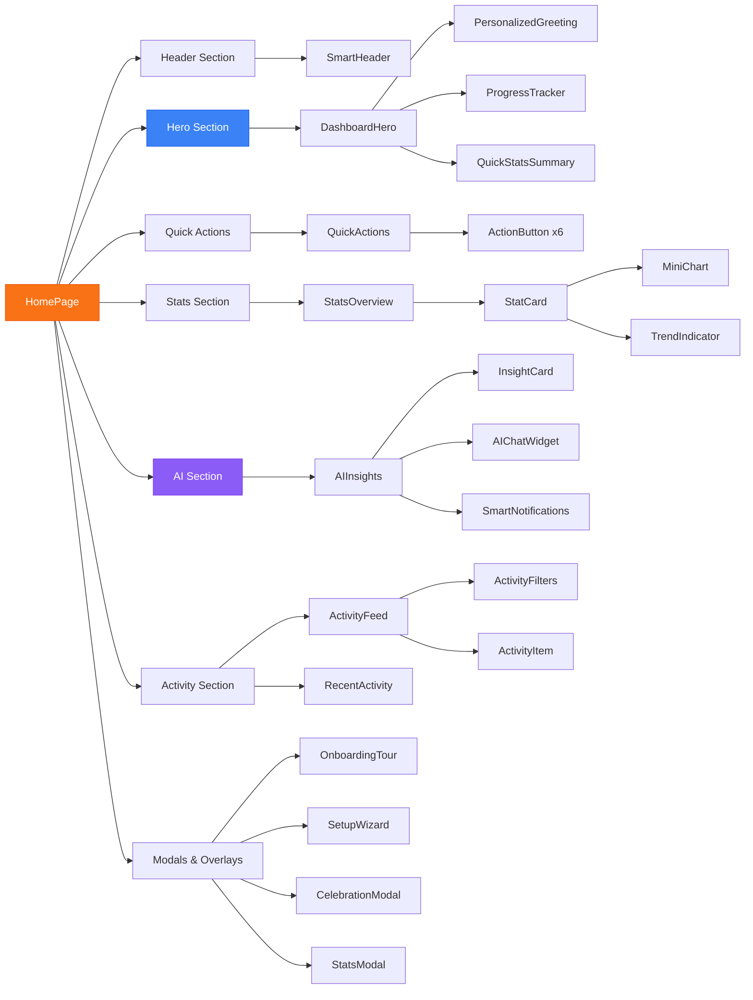

---

## 🔄 Data Flow Diagram

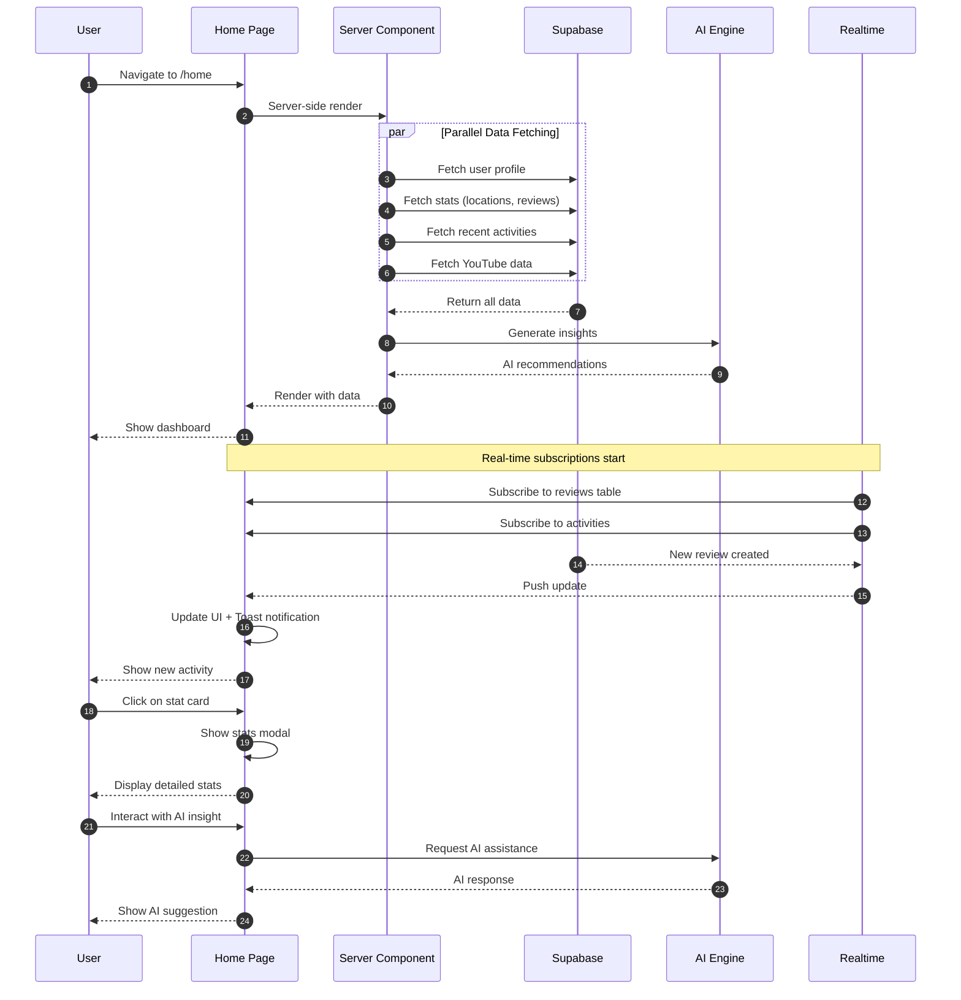

---

## 📊 State Management Structure

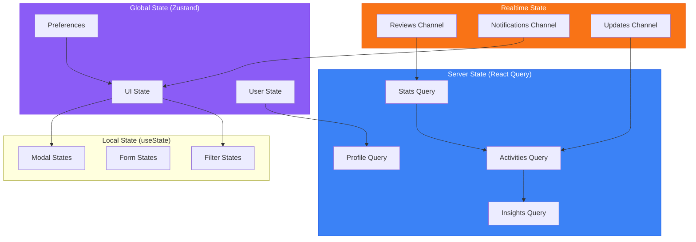

---

## 🎮 Gamification System

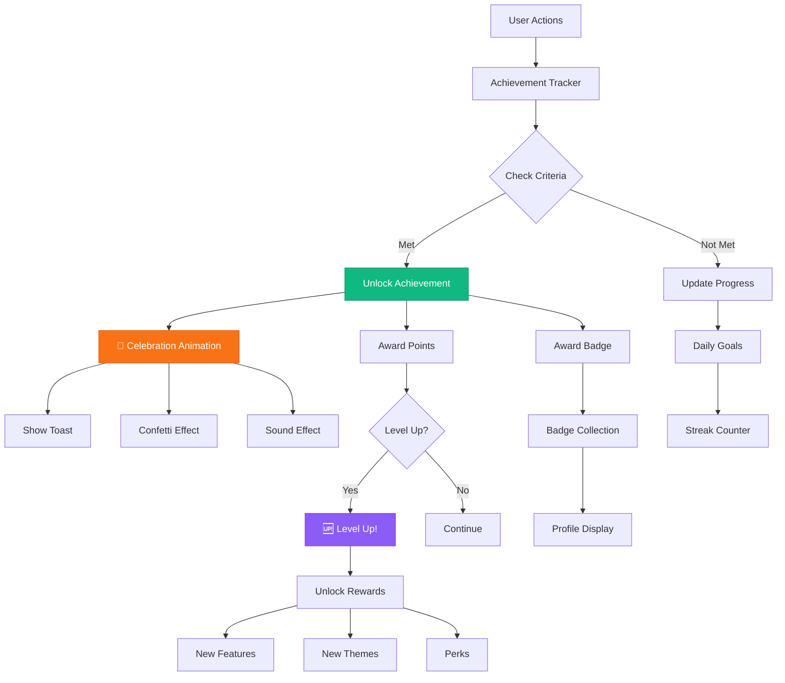

---

## 🎯 AI Insights Engine

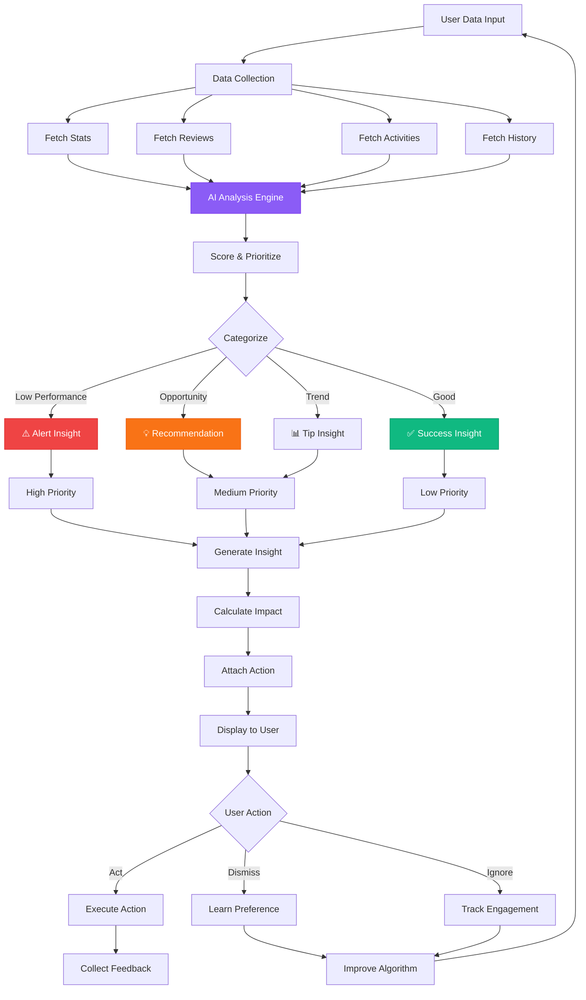

---

## 📱 Responsive Layout

```mermaid
graph TD
    Layout[Responsive Layout]

    Layout --> Mobile[📱 Mobile <768px]
    Layout --> Tablet[📱 Tablet 768-1024px]
    Layout --> Desktop[💻 Desktop 1024-1440px]
    Layout --> Large[🖥️ Large >1440px]

    Mobile --> M1[Single Column]
    Mobile --> M2[Stacked Components]
    Mobile --> M3[Bottom Navigation]
    Mobile --> M4[Compact Header]

    Tablet --> T1[2 Column Grid]
    Tablet --> T2[Side-by-Side Stats]
    Tablet --> T3[Collapsible Sidebar]

    Desktop --> D1[3 Column Grid]
    Desktop --> D2[Full Stats Grid]
    Desktop --> D3[Split Activity View]
    Desktop --> D4[Expanded Header]

    Large --> L1[4 Column Grid]
    Large --> L2[Wide Layout]
    Large --> L3[Side Panels]
    Large --> L4[More Whitespace]

    style Mobile fill:#ef4444,stroke:#dc2626,color:#fff
    style Tablet fill:#f97316,stroke:#ea580c,color:#fff
    style Desktop fill:#3b82f6,stroke:#2563eb,color:#fff
    style Large fill:#8b5cf6,stroke:#7c3aed,color:#fff
```

---

## 🔔 Notification System

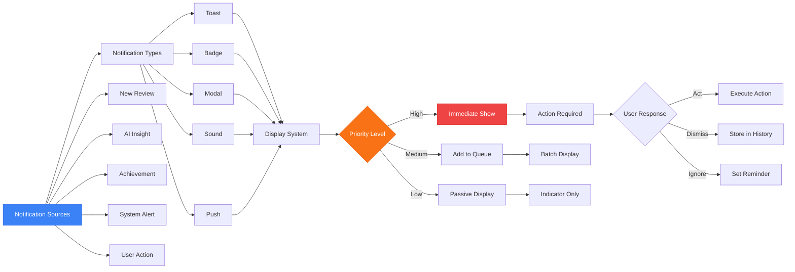

---

## 🎨 Animation Timeline

```mermaid
gantt
    title Page Load Animation Sequence
    dateFormat X
    axisFormat %L ms

    section Background
    Gradient Fade In        :a1, 0, 300
    Blobs Appear           :a2, 100, 400

    section Header
    Header Slide Down      :b1, 200, 300
    Avatar Pop In          :b2, 300, 200
    Actions Fade In        :b3, 400, 300

    section Hero
    Greeting Appear        :c1, 500, 400
    Progress Bar Fill      :c2, 600, 600
    Quick Stats Count Up   :c3, 700, 800

    section Quick Actions
    Action 1              :d1, 800, 100
    Action 2              :d2, 850, 100
    Action 3              :d3, 900, 100
    Action 4              :d4, 950, 100
    Action 5              :d5, 1000, 100
    Action 6              :d6, 1050, 100

    section Stats
    Stat Card 1           :e1, 1100, 200
    Stat Card 2           :e2, 1150, 200
    Stat Card 3           :e3, 1200, 200
    Stat Card 4           :e4, 1250, 200

    section Content
    AI Insights           :f1, 1300, 300
    Activity Feed         :f2, 1400, 300
    Recent Activity       :f3, 1500, 300
```

---

## 🧩 Component Dependencies

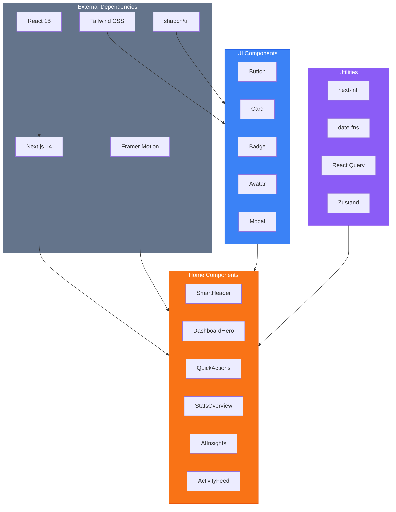

---

## 🔐 Security & Privacy

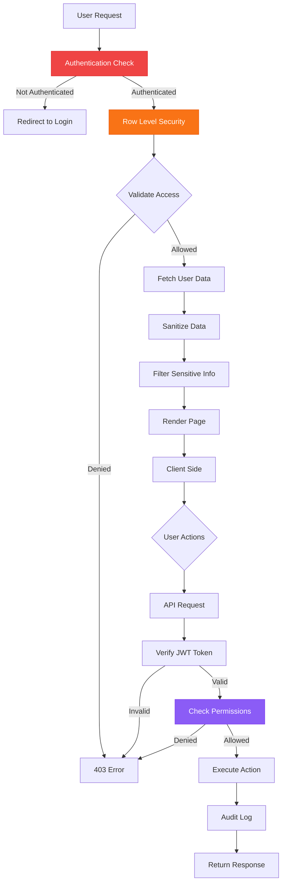

---

## 📊 Performance Optimization

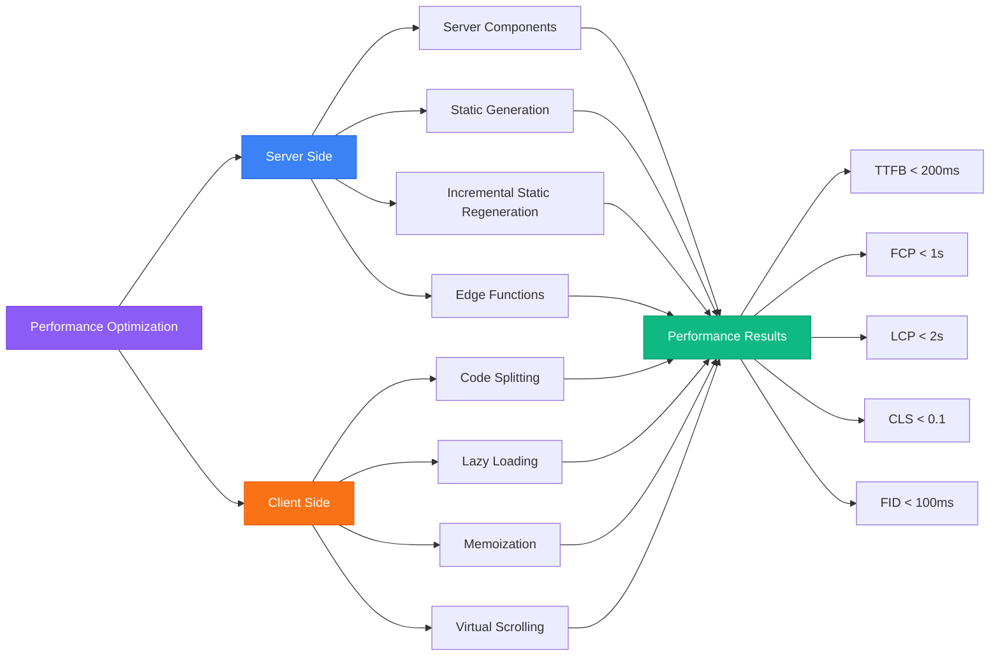

---

## 🎯 Testing Strategy

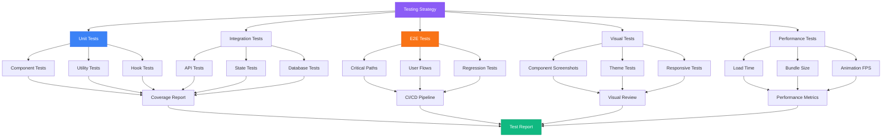

---

## 🚀 Deployment Pipeline

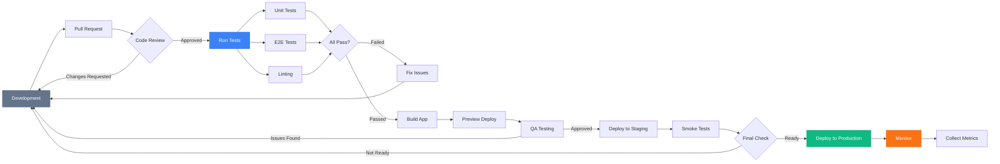

---

**🎨 جميع الـ Diagrams جاهزة للمراجعة!**

يمكنك عرض هذه الـ diagrams في أي Markdown viewer يدعم Mermaid (مثل GitHub, GitLab, VS Code, أو Obsidian).
