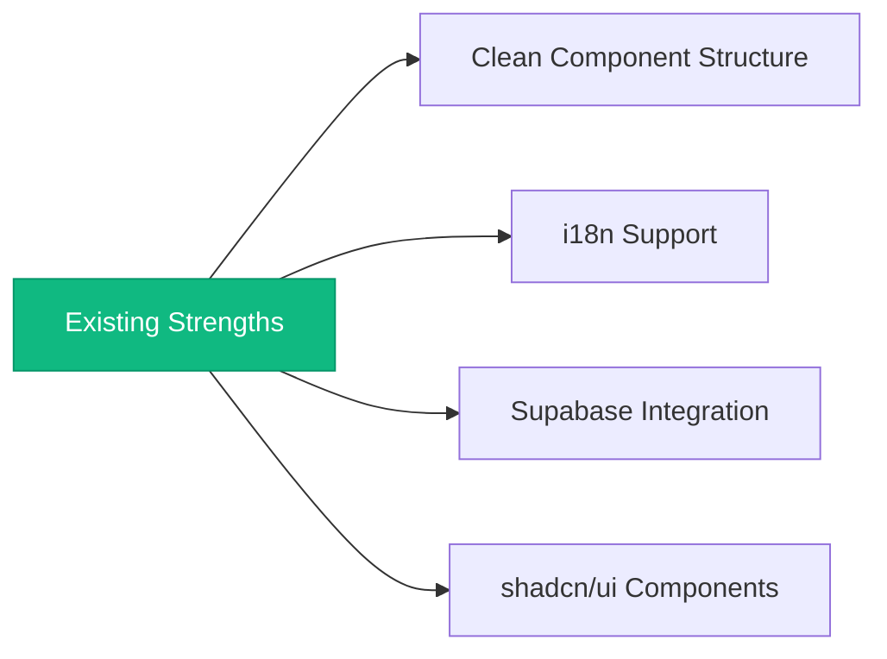
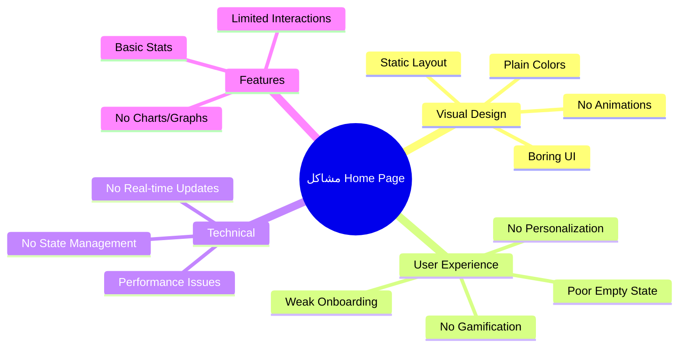
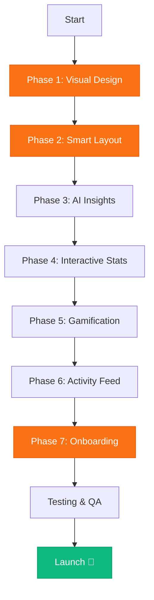
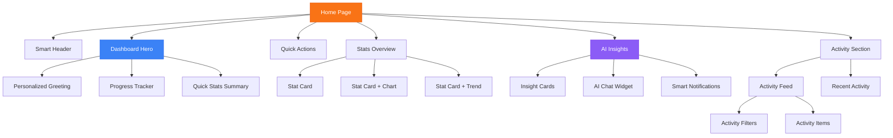
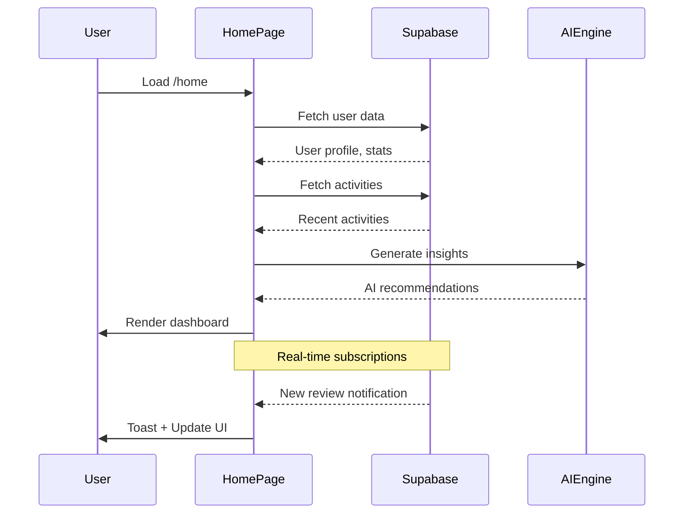
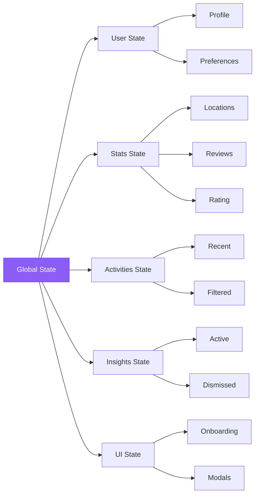
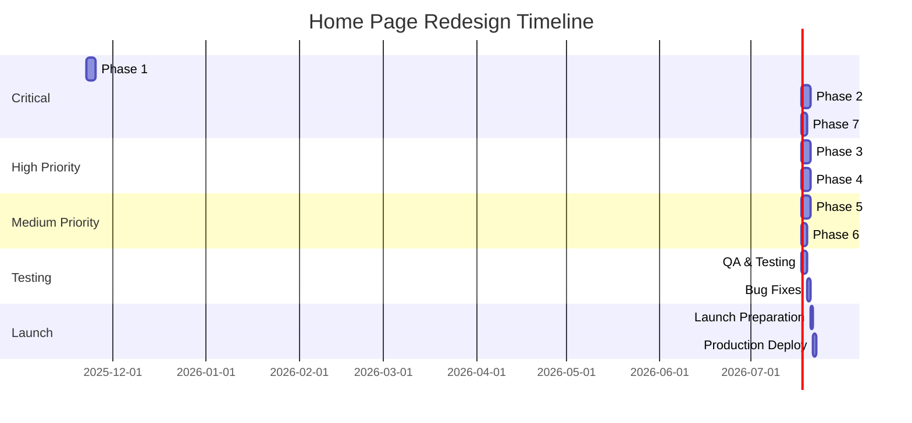
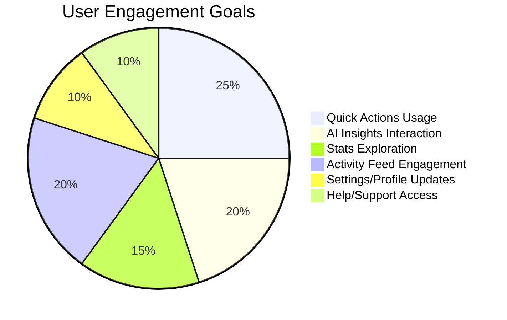
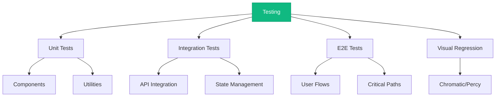

# 🎯 خطة تحسين صفحة Home للمستخدمين المسجلين

> **تاريخ الإنشاء:** 21 نوفمبر 2025  
> **الحالة:** Ready for Implementation  
> **الأولوية:** High Priority 🔥

---

## 📑 جدول المحتويات

1. [نظرة عامة](#نظرة-عامة)
2. [التحليل الحالي](#التحليل-الحالي)
3. [الرؤية والأهداف](#الرؤية-والأهداف)
4. [المراحل التنفيذية](#المراحل-التنفيذية)
5. [الـ Architecture](#architecture)
6. [Timeline](#timeline)
7. [Success Metrics](#success-metrics)

---

## 🎯 نظرة عامة

### المشكلة

صفحة الـ Home الحالية للمستخدمين المسجلين تفتقر إلى:

- ❌ Visual appeal والـ animations الموجودة في Landing page
- ❌ Personalization والـ smart features
- ❌ Engaging user experience
- ❌ Modern dashboard feel

### الحل

تحويل صفحة الـ Home إلى **Smart AI-Powered Dashboard** احترافي مع:

- ✅ Stunning visual design مع animations
- ✅ Personalized experience لكل مستخدم
- ✅ Interactive & engaging UI
- ✅ Real-time updates & AI insights

---

## 📊 التحليل الحالي

### ✅ نقاط القوة



**المكونات الموجودة:**

- `SmartHeader` - Header with user info
- `QuickActions` - 6 action buttons
- `StatsOverview` - 4-5 stat cards
- `ActivityFeed` - Recent activities
- `AIInsights` - AI recommendations
- `EmptyState` - For new users

### ❌ المشاكل الأساسية



---

## 🎨 الرؤية والأهداف

### Vision Statement

> "تحويل صفحة Home إلى **AI-Powered Command Center** يجمع بين الجمال والوظيفة، يحفز المستخدم، ويوفر insights ذكية تساعد في نمو الأعمال"

### الأهداف الرئيسية

1. **🎨 Visual Excellence**
   - تصميم يضاهي أفضل SaaS dashboards
   - Animations سلسة ومدروسة
   - Color scheme متناسق مع brand

2. **🧠 Smart & Personalized**
   - AI insights قوية ومفيدة
   - Personalization بناءً على سلوك المستخدم
   - Contextual recommendations

3. **⚡ Fast & Responsive**
   - Loading times < 1 second
   - Smooth 60fps animations
   - Optimized performance

4. **🎮 Engaging & Fun**
   - Gamification elements
   - Achievement system
   - Progress tracking

---

## 🚀 المراحل التنفيذية



---

### 🎨 المرحلة 1: Visual Design & Animations

**Priority:** 🔥🔥🔥🔥🔥 CRITICAL  
**Duration:** 2-3 days

#### الأهداف

- جعل الصفحة حيوية وجذابة مثل Landing page
- إضافة animations احترافية
- تحسين color scheme

#### المهام

**1.1 Global Styling**

```typescript
// Add to home/page.tsx
- Gradient background (from-black via-gray-900 to-black)
- Animated background blobs
- Glassmorphism effects for cards
- Consistent orange/yellow accents
```

**1.2 Component Animations**

- [ ] Stats cards: Fade in + scale + counter animation
- [ ] Quick actions: Stagger animation
- [ ] Activity feed: Slide in from bottom
- [ ] AI insights: Pulse effect for high priority
- [ ] Header: Smooth entrance

**1.3 Micro-interactions**

- [ ] Hover effects على كل الـ cards
- [ ] Click ripple effects
- [ ] Loading skeletons
- [ ] Success/error toasts

#### الملفات المتأثرة

```
✏️ app/[locale]/home/page.tsx
✏️ components/home/stats-overview.tsx
✏️ components/home/quick-actions.tsx
✏️ components/home/activity-feed.tsx
✏️ components/home/ai-insights.tsx
✏️ components/home/smart-header.tsx
```

#### Code Example

```tsx
// Animated stat card with counter
<motion.div
  initial={{ opacity: 0, y: 20 }}
  animate={{ opacity: 1, y: 0 }}
  transition={{ duration: 0.5, delay: index * 0.1 }}
  whileHover={{ scale: 1.05, y: -5 }}
  className="relative overflow-hidden"
>
  <div className="absolute inset-0 bg-gradient-to-br from-primary/10 to-transparent" />
  <AnimatedCounter value={stat.value} />
</motion.div>
```

---

### 📐 المرحلة 2: Smart Dashboard Layout

**Priority:** 🔥🔥🔥🔥🔥 CRITICAL  
**Duration:** 2-3 days

#### الأهداف

- إعادة تصميم الـ layout بشكل احترافي
- إضافة hero section
- تحسين responsive design

#### المهام

**2.1 Dashboard Hero**

```typescript
// New component: hero-dashboard.tsx
- Personalized greeting (Good morning, {name}!)
- Profile completion progress bar
- Quick stats summary
- Today's highlights
```

**2.2 Layout Restructure**

```
┌─────────────────────────────────────────┐
│          Smart Header                   │
├─────────────────────────────────────────┤
│          Dashboard Hero                 │
│    (Greeting + Progress + Quick Stats)  │
├─────────────────────────────────────────┤
│          Quick Actions (6 buttons)      │
├─────────────────────────────────────────┤
│      Stats Overview (4-5 cards)         │
├─────────────────────────────────────────┤
│      AI Insights (Full Width)           │
├──────────────────┬──────────────────────┤
│  Activity Feed   │  Recent Activity     │
│   (2 columns)    │    (1 column)        │
│                  │                      │
└──────────────────┴──────────────────────┘
```

**2.3 Responsive Breakpoints**

- [ ] Mobile: Single column
- [ ] Tablet: 2 columns
- [ ] Desktop: 3 columns
- [ ] Large: 4 columns

#### المكونات الجديدة

```
📁 components/home/
  ├── hero-dashboard.tsx (NEW)
  ├── progress-tracker.tsx (NEW)
  └── dashboard-tabs.tsx (NEW)
```

---

### 🤖 المرحلة 3: Enhanced AI Insights

**Priority:** 🔥🔥🔥🔥 HIGH  
**Duration:** 2-3 days

#### الأهداف

- جعل الـ AI insights أكثر ذكاءً
- إضافة interactive elements
- تحسين visualization

#### المهام

**3.1 Smart Insights Engine**

```typescript
// Enhanced insights logic
- Priority scoring algorithm
- Trend analysis
- Predictive recommendations
- Impact calculation
```

**3.2 AI Chat Widget**

- [ ] Floating chat button
- [ ] Quick AI assistance
- [ ] Context-aware suggestions
- [ ] Voice input support (optional)

**3.3 Insights Visualization**

- [ ] Mini charts in insights
- [ ] Progress indicators
- [ ] Impact badges
- [ ] Action buttons

**3.4 Notification System**

- [ ] Real-time insight notifications
- [ ] Toast messages
- [ ] Badge counters
- [ ] Sound effects (optional)

#### المكونات الجديدة

```
📁 components/home/
  ├── ai-chat-widget.tsx (NEW)
  ├── insights-carousel.tsx (NEW)
  ├── smart-notifications.tsx (NEW)
  └── insight-card-enhanced.tsx (NEW)
```

---

### 📊 المرحلة 4: Interactive Stats & Analytics

**Priority:** 🔥🔥🔥🔥 HIGH  
**Duration:** 2-3 days

#### الأهداف

- جعل الإحصائيات تفاعلية
- إضافة mini charts
- Real-time updates

#### المهام

**4.1 Enhanced Stats Cards**

```typescript
// Stats with sparklines
<StatsCard
  value={1250}
  change={+12.5}
  trend="up"
  sparklineData={[100, 120, 110, 150, 125]}
  clickable={true}
  expandable={true}
/>
```

**4.2 Interactive Features**

- [ ] Click to expand details
- [ ] Hover for more info
- [ ] Comparison tooltips
- [ ] Export data button

**4.3 Real-time Updates**

- [ ] Supabase realtime subscriptions
- [ ] Auto-refresh stats
- [ ] Live activity feed
- [ ] Animated updates

**4.4 Mini Charts**

- [ ] Sparklines للـ trends
- [ ] Small pie charts
- [ ] Progress rings
- [ ] Trend indicators

#### المكونات الجديدة

```
📁 components/home/
  ├── mini-chart.tsx (NEW)
  ├── sparkline.tsx (NEW)
  ├── trend-indicator.tsx (NEW)
  └── stats-modal.tsx (NEW)
```

---

### 🎮 المرحلة 5: Gamification & Achievements

**Priority:** 🔥🔥🔥 MEDIUM  
**Duration:** 2-3 days

#### الأهداف

- تحفيز المستخدم
- زيادة engagement
- إضافة fun elements

#### المهام

**5.1 Achievement System**

```typescript
// Achievement types
- First Review Reply
- 100 Reviews Managed
- Perfect Week (replied to all)
- 5-Star Champion
- AI Master (used AI 50 times)
```

**5.2 Daily Goals**

- [ ] Goal cards
- [ ] Progress tracking
- [ ] Completion celebrations
- [ ] Streak counter

**5.3 Gamification Elements**

- [ ] Points system
- [ ] Level progression
- [ ] Badges collection
- [ ] Leaderboard (optional)

**5.4 Celebration Animations**

- [ ] Confetti on achievement
- [ ] Success modal
- [ ] Sound effects
- [ ] Share achievement

#### المكونات الجديدة

```
📁 components/home/
  ├── achievements.tsx (NEW)
  ├── daily-goals.tsx (NEW)
  ├── streak-tracker.tsx (NEW)
  ├── celebration-modal.tsx (NEW)
  └── points-badge.tsx (NEW)
```

---

### 📰 المرحلة 6: Enhanced Activity Feed

**Priority:** 🔥🔥🔥 MEDIUM  
**Duration:** 2 days

#### المهام

**6.1 Advanced Filtering**

- [ ] Filter by type
- [ ] Filter by date range
- [ ] Filter by priority
- [ ] Search functionality

**6.2 Rich Content**

- [ ] Image previews
- [ ] Video thumbnails
- [ ] Rich text formatting
- [ ] Emojis support

**6.3 Quick Actions**

- [ ] Reply directly
- [ ] Mark as done
- [ ] Archive activity
- [ ] Share activity

**6.4 Pagination**

- [ ] Infinite scroll
- [ ] Load more button
- [ ] Skeleton loading
- [ ] Empty states

---

### 🎓 المرحلة 7: Onboarding & Empty States

**Priority:** 🔥🔥🔥🔥🔥 CRITICAL  
**Duration:** 1-2 days

#### الأهداف

- تحسين first-time experience
- إرشاد المستخدم الجديد
- تقليل bounce rate

#### المهام

**7.1 Interactive Tour**

```typescript
// Guided tour steps
1. Welcome message
2. Quick actions highlight
3. Stats explanation
4. AI insights intro
5. Activity feed walkthrough
6. Settings pointer
```

**7.2 Setup Wizard**

- [ ] Multi-step form
- [ ] Progress indicator
- [ ] Skip option
- [ ] Save progress

**7.3 Enhanced Empty States**

- [ ] Beautiful illustrations
- [ ] Clear CTAs
- [ ] Video tutorials
- [ ] Help links

**7.4 Contextual Help**

- [ ] Tooltips
- [ ] Info popovers
- [ ] Help center links
- [ ] Live chat widget

#### المكونات الجديدة

```
📁 components/home/
  ├── onboarding-tour.tsx (NEW)
  ├── setup-wizard.tsx (NEW)
  ├── help-tooltips.tsx (NEW)
  ├── progress-checklist.tsx (NEW)
  └── empty-state-enhanced.tsx (NEW)
```

---

## 🏗️ Architecture

### Component Hierarchy



### Data Flow



### State Management



---

## ⏱️ Timeline



**إجمالي الوقت:** 8-13 يوم عمل (2-3 أسابيع)

---

## 📈 Success Metrics

### Primary KPIs

| Metric                    | Current | Target | Measurement         |
| ------------------------- | ------- | ------ | ------------------- |
| **Time on Page**          | ~30s    | 2+ min | Google Analytics    |
| **Bounce Rate**           | ~60%    | <30%   | Analytics           |
| **Feature Usage**         | ~20%    | 70%+   | Event tracking      |
| **Onboarding Completion** | ~40%    | 75%+   | Custom tracking     |
| **Daily Active Users**    | -       | 60%+   | Retention analytics |

### Secondary Metrics



### Success Criteria

✅ **Visual Excellence**

- [ ] 9/10 rating in user feedback
- [ ] <1s page load time
- [ ] 60fps smooth animations

✅ **User Engagement**

- [ ] 70%+ use Quick Actions
- [ ] 50%+ interact with AI Insights
- [ ] 60%+ explore stats details

✅ **Onboarding**

- [ ] 75%+ complete onboarding
- [ ] <5% skip tour
- [ ] 80%+ connect first account

✅ **Retention**

- [ ] 60%+ daily return rate
- [ ] 80%+ weekly return rate
- [ ] <10% churn in first week

---

## 🎨 Design System

### Colors

```css
/* Primary - Orange */
--primary: #f97316;
--primary-hover: #ea580c;
--primary-light: #fb923c;

/* Backgrounds */
--bg-dark: #000000;
--bg-gray-900: #111827;
--bg-gray-800: #1f2937;

/* Accents */
--accent-blue: #3b82f6;
--accent-purple: #8b5cf6;
--accent-green: #10b981;
--accent-red: #ef4444;
--accent-yellow: #eab308;

/* Glass Effect */
--glass-bg: rgba(0, 0, 0, 0.5);
--glass-border: rgba(249, 115, 22, 0.2);
```

### Typography

```css
/* Headings */
--font-heading: "Inter", system-ui, sans-serif;
--heading-weight: 700;

/* Body */
--font-body: "Inter", system-ui, sans-serif;
--body-weight: 400;

/* Stats */
--font-stats: "Inter", system-ui, sans-serif;
--stats-weight: 800;
```

### Spacing

```css
/* Consistent spacing scale */
--space-xs: 0.25rem; /* 4px */
--space-sm: 0.5rem; /* 8px */
--space-md: 1rem; /* 16px */
--space-lg: 1.5rem; /* 24px */
--space-xl: 2rem; /* 32px */
--space-2xl: 3rem; /* 48px */
```

---

## 🛠️ Technical Stack

### Frontend

- **Framework:** Next.js 14
- **UI Library:** shadcn/ui + Tailwind CSS
- **Animations:** Framer Motion
- **Charts:** Recharts / Chart.js
- **Icons:** Lucide React

### Backend

- **Database:** Supabase (PostgreSQL)
- **Auth:** Supabase Auth
- **Real-time:** Supabase Realtime
- **Storage:** Supabase Storage

### State Management

- **Server State:** TanStack Query (React Query)
- **Client State:** Zustand
- **Forms:** React Hook Form + Zod

### Utilities

- **Date:** date-fns
- **i18n:** next-intl
- **Analytics:** Google Analytics 4

---

## 🚧 Implementation Notes

### Performance Optimization

```typescript
// Lazy loading components
const AIInsights = lazy(() => import("@/components/home/ai-insights"));
const ActivityFeed = lazy(() => import("@/components/home/activity-feed"));

// Memoization
const MemoizedStats = memo(StatsOverview);

// Debouncing
const debouncedSearch = useDebouncedCallback((value) => {
  setSearchTerm(value);
}, 300);
```

### Accessibility

- [ ] ARIA labels على كل الـ interactive elements
- [ ] Keyboard navigation support
- [ ] Focus management
- [ ] Screen reader friendly
- [ ] Color contrast compliance (WCAG AA)

### Error Handling

```typescript
// Error boundaries
<ErrorBoundary fallback={<ErrorFallback />}>
  <Dashboard />
</ErrorBoundary>

// Graceful degradation
if (!stats) {
  return <StatsSkeleton />;
}
```

### Testing Strategy



---

## 📚 Resources

### Design Inspiration

- [Linear](https://linear.app) - Clean dashboard design
- [Vercel](https://vercel.com/dashboard) - Modern analytics
- [Stripe](https://dashboard.stripe.com) - Stats visualization
- [Notion](https://notion.so) - User onboarding

### Documentation

- [Framer Motion Docs](https://www.framer.com/motion/)
- [shadcn/ui Components](https://ui.shadcn.com/)
- [Supabase Realtime](https://supabase.com/docs/guides/realtime)
- [Next.js 14 Docs](https://nextjs.org/docs)

---

## ✅ Definition of Done

### Phase Completion Checklist

- [ ] All components implemented
- [ ] Animations working smoothly (60fps)
- [ ] Responsive on all devices
- [ ] i18n translations complete (EN + AR)
- [ ] Unit tests written (>80% coverage)
- [ ] E2E tests for critical paths
- [ ] Accessibility audit passed
- [ ] Performance benchmarks met
- [ ] Code review approved
- [ ] QA testing completed
- [ ] Documentation updated

---

## 🎯 Next Steps

### إذا وافقت على الخطة:

1. **Review & Approve** ✅
2. **Start Phase 1** - Visual Design (2-3 days)
3. **Start Phase 2** - Smart Layout (2-3 days)
4. **Continue with other phases** based on priority

### القرار بيدك! 🚀

**هل الخطة معجبتك ومستعد نبدأ التنفيذ؟**

---

**Created by:** Cascade AI  
**Last Updated:** Nov 21, 2025  
**Status:** 🟢 Ready for Implementation
