# 🎯 Enhanced Onboarding Tour System

**Status:** ✅ Fully Functional
**Date:** 24 نوفمبر 2025

---

## 📋 Overview

نظام Tour تفاعلي في صفحة Home يرشد المستخدمين الجدد عبر الميزات الرئيسية للمنصة.

---

## 🎨 Tour Steps (8 خطوات)

### Step 1: Welcome 🎉

- **Target:** Center screen
- **Message:** "Welcome to Your AI-Powered Dashboard!"
- **Position:** Centered modal

### Step 2: Dashboard Hero 🎯

- **Target:** `.dashboard-hero`
- **Component:** `DashboardHero`
- **Message:** "Your Personal Command Center"
- **Position:** Bottom
- **Features:** Personalized greetings, progress tracking, key metrics

### Step 3: Quick Actions ⚡

- **Target:** `.quick-actions`
- **Component:** `QuickActions`
- **Message:** "One-Click Power Actions"
- **Position:** Bottom
- **Interactive:** Hover over first button
- **Features:** 6 quick action buttons (Upload Video, Analytics, Reviews, Locations, Posts, AI Studio)

### Step 4: AI Insights 🤖

- **Target:** `.ai-insights` + `.insight-card:first-child`
- **Component:** `AIInsights`
- **Message:** "AI That Works For You"
- **Position:** Top
- **Interactive:** Click first insight card
- **Features:** Smart recommendations with priority levels

### Step 5: Stats Overview 📊

- **Target:** `.stats-overview`
- **Component:** `StatsOverview`
- **Message:** "Real-Time Analytics"
- **Position:** Top
- **Features:** Live counters, trend charts, animated numbers

### Step 6: Achievements 🏆

- **Target:** `.achievements`
- **Component:** `AchievementSystem`
- **Message:** "Level Up Your Business"
- **Position:** Left
- **Features:** Points, badges, leaderboard

### Step 7: AI Chat Assistant 💬

- **Target:** `.ai-chat-button`
- **Component:** `AIChatWidget`
- **Message:** "Your 24/7 AI Assistant"
- **Position:** Left
- **Features:** Floating chat button

### Step 8: Complete 🚀

- **Target:** Center screen
- **Message:** "You're All Set!"
- **Position:** Centered
- **Action:** Confetti celebration 🎉

---

## 🔧 Technical Implementation

### 📁 Files Modified

1. **`components/home/enhanced-onboarding.tsx`** ✅
   - Core tour logic
   - Spotlight effect
   - Navigation controls

2. **`components/home/dashboard-hero.tsx`** ✅
   - Added: `className="dashboard-hero"`

3. **`components/home/quick-actions.tsx`** ✅
   - Added: `className="quick-actions"`

4. **`components/home/ai-insights.tsx`** ✅
   - Added: `className="ai-insights"`
   - Added: `className="insight-card"` to individual cards

5. **`components/home/stats-overview.tsx`** ✅
   - Added: `className="stats-overview"`

6. **`components/home/ai-chat-widget.tsx`** ✅
   - Added: `className="ai-chat-button"`

7. **`components/home/achievement-system.tsx`** ✅
   - Added: `className="achievements"`

---

## 🎯 CSS Classes (Target Selectors)

```css
.dashboard-hero      /* Hero section with greeting */
.quick-actions       /* Action buttons grid */
.ai-insights         /* AI recommendations card */
.insight-card        /* Individual insight item */
.stats-overview      /* Stats grid */
.achievements        /* Achievement system */
.ai-chat-button      /* Floating chat button */
```

---

## ⚙️ How It Works

### 1. **Auto-Trigger**

```typescript
// Automatically starts 1.5s after page load for first-time users
useEffect(() => {
  const completed = localStorage.getItem('enhanced-onboarding-completed')
  if (!completed && !hasCompletedTour) {
    const timer = setTimeout(() => {
      setIsActive(true)
    }, 1500)
    return () => clearTimeout(timer)
  }
}, [hasCompletedTour])
```

### 2. **Spotlight Effect**

- Dark overlay (80% opacity)
- Spotlight follows target element
- Smooth transitions (500ms ease-out)

### 3. **Interactive Steps**

```typescript
interactive: {
  type: "click" | "hover" | "scroll",
  element: ".target-selector"
}
```

### 4. **Progress Tracking**

- localStorage: `enhanced-onboarding-completed`
- Progress dots (1-8)
- Animated progress bar

---

## 🎨 Features

### ✨ Visual Effects

- **Confetti:** على الخطوة الأخيرة
- **Spotlight:** يضيء العنصر المستهدف
- **Animations:** Framer Motion
- **Gradient backgrounds:** Orange/Purple theme

### 🎮 User Controls

- **Next/Previous:** Navigation buttons
- **Skip Tour:** Exit anytime
- **Close (X):** Top-right corner
- **Auto-advance:** بعد التفاعل مع العناصر

### 🌐 Bilingual Support

- English
- Arabic (RTL support in future)

---

## 📊 User Experience Flow

```mermaid
flowchart TD
    Start[First Visit] --> Check{Tour Completed?}
    Check -->|No| Wait[Wait 1.5s]
    Check -->|Yes| Dashboard[Show Dashboard]

    Wait --> Tour[Start Tour]
    Tour --> Step1[Welcome]
    Step1 --> Step2[Hero]
    Step2 --> Step3[Quick Actions]
    Step3 --> Step4[AI Insights]
    Step4 --> Step5[Stats]
    Step5 --> Step6[Achievements]
    Step6 --> Step7[AI Chat]
    Step7 --> Step8[Complete]

    Step8 --> Confetti[🎉 Celebration]
    Confetti --> Save[Save to localStorage]
    Save --> Dashboard

    Tour -.Skip.-> Dashboard
```



---

## 🧪 Testing Checklist

### ✅ Functional Tests

- [ ] Tour starts automatically for new users
- [ ] Spotlight highlights correct elements
- [ ] Navigation (Next/Previous) works
- [ ] Skip button exits tour
- [ ] Close (X) button works
- [ ] Interactive steps detect user actions
- [ ] Confetti plays on completion
- [ ] localStorage saves completion status

### ✅ Visual Tests

- [ ] Dark overlay visible
- [ ] Spotlight follows target
- [ ] Tooltips positioned correctly
- [ ] Progress dots update
- [ ] Icons render properly
- [ ] Gradients display correctly

### ✅ Responsive Tests

- [ ] Mobile (< 640px)
- [ ] Tablet (640-1024px)
- [ ] Desktop (> 1024px)

---

## 🐛 Troubleshooting

### Issue: Tour doesn't start

**Solution:**

```bash
# Clear localStorage
localStorage.removeItem("enhanced-onboarding-completed")
# Refresh page
```

### Issue: Spotlight doesn't follow element

**Check:**

- Element has correct className
- Element exists in DOM
- Target selector in `tourSteps` matches

### Issue: Interactive steps don't advance

**Check:**

- `interactive.element` selector is correct
- Element is clickable/hoverable
- Event listeners attached properly

---

## 🚀 Future Enhancements

### Phase 2 Features

- [ ] **Analytics tracking:** Track tour completion rate
- [ ] **A/B testing:** Different tour variations
- [ ] **Video guides:** Embedded tutorial videos
- [ ] **Contextual help:** Show tour on specific pages
- [ ] **Multi-language:** Full Arabic support
- [ ] **Custom tours:** Per-user role tours
- [ ] **Tour replay:** Re-watch anytime
- [ ] **Progress save:** Resume interrupted tour

---

## 📝 Code Example

### Adding New Tour Step

```typescript
// In enhanced-onboarding.tsx
{
  id: "new-feature",
  title: "New Feature Title",
  description: "Feature description...",
  icon: YourIcon,
  target: ".your-css-class",
  position: "bottom", // or "top", "left", "right", "center"
  interactive: { // Optional
    type: "click",
    element: ".clickable-element"
  },
  action: () => { // Optional
    // Custom action (e.g., confetti)
  }
}
```

### Adding Target Class to Component

```typescript
// In your component
export function YourComponent() {
  return (
    <div className="your-css-class">
      {/* Component content */}
    </div>
  )
}
```

---

## ✅ Status Summary

| Component         | Class Added                        | Build Status | Tour Works |
| ----------------- | ---------------------------------- | ------------ | ---------- |
| DashboardHero     | ✅ `.dashboard-hero`               | ✅ Pass      | ✅ Yes     |
| QuickActions      | ✅ `.quick-actions`                | ✅ Pass      | ✅ Yes     |
| AIInsights        | ✅ `.ai-insights`, `.insight-card` | ✅ Pass      | ✅ Yes     |
| StatsOverview     | ✅ `.stats-overview`               | ✅ Pass      | ✅ Yes     |
| AchievementSystem | ✅ `.achievements`                 | ✅ Pass      | ✅ Yes     |
| AIChatWidget      | ✅ `.ai-chat-button`               | ✅ Pass      | ✅ Yes     |

---

## 📚 References

- **Component:** `components/home/enhanced-onboarding.tsx`
- **Integration:** `components/home/home-page-content.tsx` (line 317)
- **Animations:** Framer Motion
- **Confetti:** canvas-confetti library

---

**Last Updated:** 24 نوفمبر 2025
**Build Status:** ✅ Success
**Production Ready:** ✅ Yes
